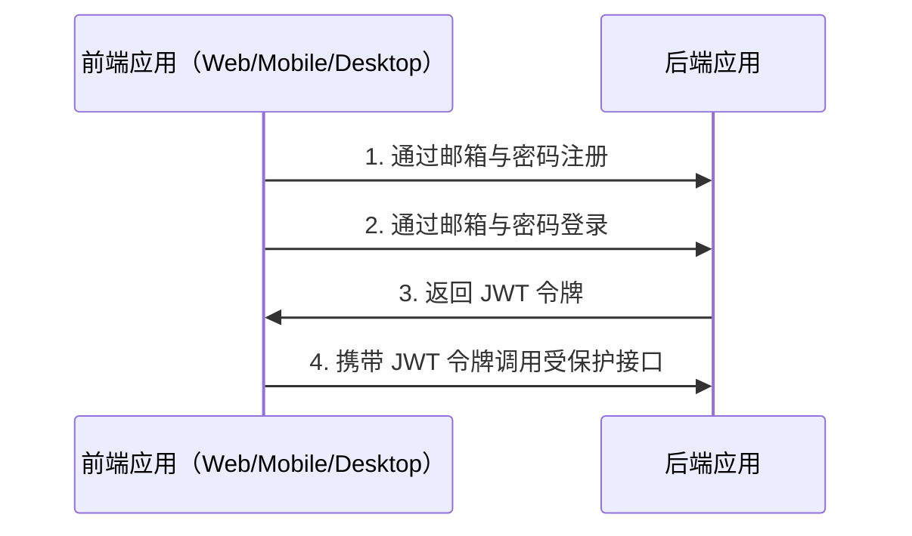
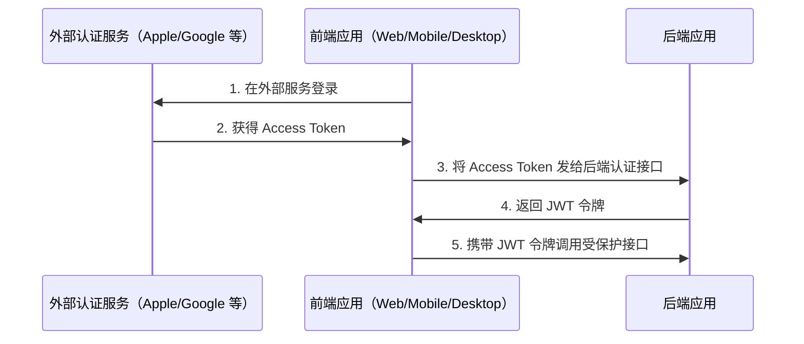

# 认证（Auth）

## 目录 <!-- omit in toc -->

- [总体说明](#总体说明)
  - [邮箱与密码认证流程](#邮箱与密码认证流程)
  - [第三方/社交登录流程](#第三方社交登录流程)
- [认证配置](#认证配置)
- [Apple 登录](#apple-登录)
- [Facebook 登录](#facebook-登录)
- [Google 登录](#google-登录)
- [关于 JWT 策略](#关于-jwt-策略)
- [刷新令牌流程](#刷新令牌流程)
  - [视频示例](#视频示例)
  - [多设备登录 / 会话支持](#多设备登录--会话支持)
- [登出](#登出)
- [问答](#问答)
  - [为什么登出或删除会话后一段时间内仍能用旧 access token 调用接口？](#为什么登出或删除会话后一段时间内仍能用旧-access-token-调用接口)

---

## 总体说明

### 邮箱与密码认证流程

默认提供邮箱 + 密码的注册与登录。



视频示例：<https://user-images.githubusercontent.com/6001723/224566194-1c1f4e98-5691-4703-b30e-92f99ec5d929.mp4>

### 第三方/社交登录流程

同时支持 Apple / Facebook / Google 等外部认证服务。



使用外部认证的步骤：

1. 在外部服务完成登录并获取 Access Token
2. 前端将该 Token 通过以下接口发送到后端，换取 JWT：

```text
POST /api/v1/auth/facebook/login
POST /api/v1/auth/google/login
POST /api/v1/auth/apple/login
```

3. 之后使用 JWT 调用受保护接口

---

## 认证配置

1. 生成 `access token` 与 `refresh token` 的密钥：

```bash
node -e "console.log('\nAUTH_JWT_SECRET=' + require('crypto').randomBytes(256).toString('base64') + '\n\nAUTH_REFRESH_SECRET=' + require('crypto').randomBytes(256).toString('base64') + '\n\nAUTH_FORGOT_SECRET=' + require('crypto').randomBytes(256).toString('base64') + '\n\nAUTH_CONFIRM_EMAIL_SECRET=' + require('crypto').randomBytes(256).toString('base64'));"
```

2. 将输出写入 `.env` 的对应变量：

```text
AUTH_JWT_SECRET=...
AUTH_REFRESH_SECRET=...
```

## Apple 登录

1. 在 Apple 开发平台完成服务配置：<https://www.npmjs.com/package/apple-signin-auth>
2. 在 `.env` 中设置 `APPLE_APP_AUDIENCE`

```text
APPLE_APP_AUDIENCE=["com.company", "com.company.web"]
```

## Facebook 登录

1. 前往 <https://developers.facebook.com/apps/creation/> 创建应用
2. 在 `Settings -> Basic` 获取 `App ID` 与 `App Secret`
3. 在 `.env` 中设置：

```text
FACEBOOK_APP_ID=123
FACEBOOK_APP_SECRET=abc
```

## Google 登录

1. 在 [Developer Console](https://console.cloud.google.com/) 获取 `CLIENT_ID` 与 `CLIENT_SECRET`
2. 在 `.env` 中设置：

```text
GOOGLE_CLIENT_ID=abc
GOOGLE_CLIENT_SECRET=abc
```

## 关于 JWT 策略

在 `validate` 方法中不查询数据库中的用户，以避免破坏 JWT 的无状态特性并提升性能。
视频讲解：<https://www.youtube.com/watch?v=Y2H3DXDeS3Q>  文章：<https://jwt.io/introduction/>

```typescript
// src/auth/strategies/jwt.strategy.ts

@Injectable()
export class JwtStrategy extends PassportStrategy(Strategy, 'jwt') {
  public validate(payload) {
    if (!payload.id) {
      throw new UnauthorizedException();
    }
    return payload;
  }
}
```

> 如需获取完整用户信息，请在各业务服务中按需查询。

## 刷新令牌流程

1. 登录成功（`POST /api/v1/auth/email/login`）返回 `token`、`tokenExpires`、`refreshToken`
2. 之后所有普通请求在头部携带 `token`
3. 当 `token` 过期时（前端根据 `tokenExpires` 判断），将 `refreshToken` 放在 `Authorization` 头部发送到 `POST /api/v1/auth/refresh`，后端返回新的 `token`、`tokenExpires` 与 `refreshToken`

### 视频示例

<https://github.com/brocoders/nestjs-boilerplate/assets/6001723/f6fdcc89-5ec6-472b-a6fc-d24178ad1bbb>

### 多设备登录 / 会话支持

样板使用 Refresh Token + 会话（sessions）支持多设备登录。每次登录会创建一条会话记录，包含 `id`、`userId` 与 `hash`。
每次调用 `POST /api/v1/auth/refresh` 会比对数据库中的 `hash` 与 Token 中携带的 `hash`，匹配则签发新令牌，并更新数据库中的 `hash` 来使旧 Refresh Token 失效。

## 登出

1. 调用接口：

```text
POST /api/v1/auth/logout
```

2. 在前端移除 `access token` 与 `refresh token`（cookies/localStorage 等）

## 问答

### 为什么登出或删除会话后一段时间内仍能用旧 access token 调用接口？

因为使用的是无状态的 `JWT`。它不能被立即撤销，但会在 `AUTH_JWT_TOKEN_EXPIRES_IN` 指定时间后过期（默认 15 分钟）。如果必须立刻撤销，可在每次请求中于 `jwt.strategy.ts` 查询 session 是否存在，但通常不推荐，因为会影响性能。

---

- 上一页：[数据库](database.zh.md)
- 下一页：[序列化](serialization.zh.md)
