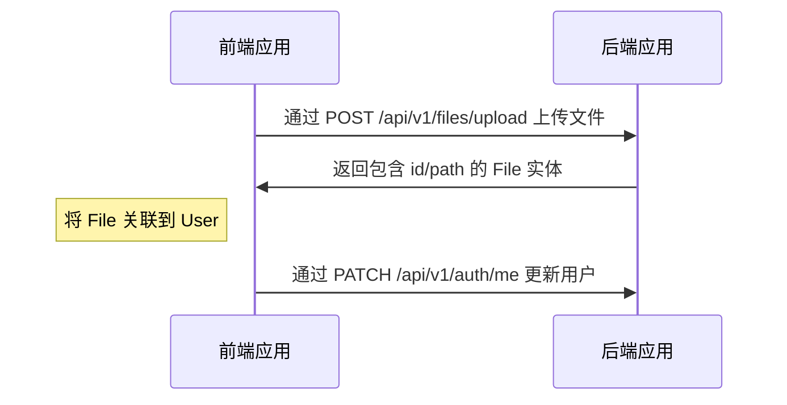
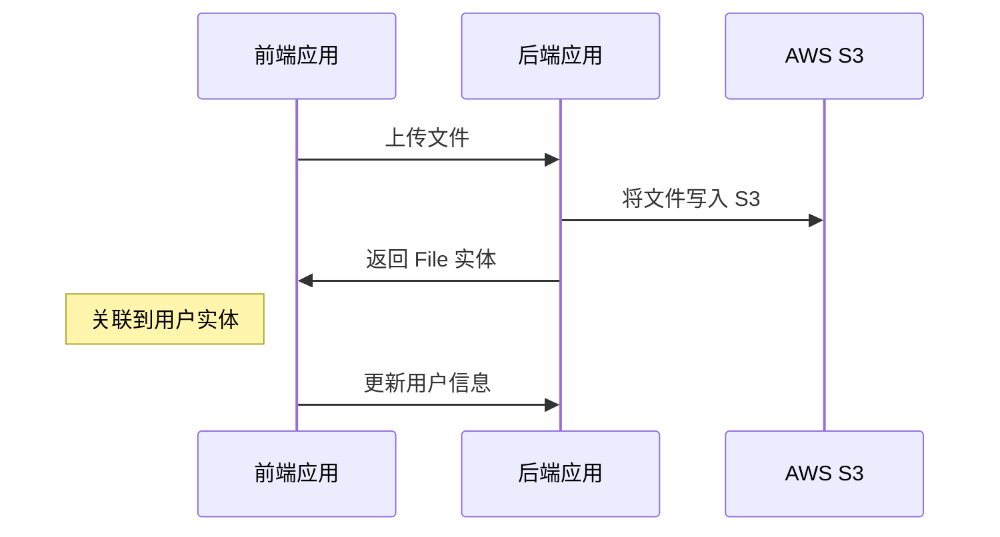
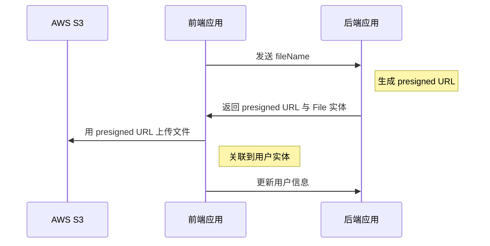

# 文件上传

---

## 目录 <!-- omit in toc -->

- [驱动支持](#驱动支持)
- [本地驱动的上传与关联流程](#本地驱动的上传与关联流程)
  - [示例：上传头像并关联到用户（local）](#示例上传头像并关联到用户local)
  - [视频示例](#视频示例)
- [S3 驱动的上传与关联流程](#s3-驱动的上传与关联流程)
  - [S3 驱动配置](#s3-驱动配置)
  - [示例：上传头像并关联到用户（S3）](#示例上传头像并关联到用户s3)
- [S3 预签名驱动的上传与关联流程](#s3-预签名驱动的上传与关联流程)
  - [S3 预签名配置](#s3-预签名配置)
  - [示例：上传头像并关联到用户（S3 Presigned URL）](#示例上传头像并关联到用户s3-presigned-url)
- [如何删除文件](#如何删除文件)

---

## 驱动支持

样板开箱即用支持 `local`、`s3` 与 `s3-presigned` 三种驱动。通过 `.env` 的 `FILE_DRIVER` 设置。

> 生产环境推荐使用 `s3-presigned` 将上传压力转移到对象存储。

---

## 本地驱动的上传与关联流程

`POST /api/v1/files/upload` 接收文件，返回 `File` 实体（含 `id`、`path`）。前端拿到 `File` 后，将其作为字段关联到目标实体（例如用户头像）。

### 示例：上传头像并关联到用户（local）



### 视频示例

<https://user-images.githubusercontent.com/6001723/224558636-d22480e4-f70a-4789-b6fc-6ea343685dc7.mp4>

## S3 驱动的上传与关联流程

同样使用 `POST /api/v1/files/upload`，服务端负责将文件上传至 S3，返回 `File` 实体。

### S3 驱动配置

1. 打开 AWS S3 控制台并创建桶（Bucket）
2. 在桶的 `Permissions` -> `CORS` 配置如下：

```json
[
  {
    "AllowedHeaders": ["*"],
    "AllowedMethods": ["GET"],
    "AllowedOrigins": ["*"],
    "ExposeHeaders": []
  }
]
```

3. 在 `.env` 中设置以下变量：

```dotenv
FILE_DRIVER=s3
ACCESS_KEY_ID=YOUR_ACCESS_KEY_ID
SECRET_ACCESS_KEY=YOUR_SECRET_ACCESS_KEY
AWS_S3_REGION=YOUR_AWS_S3_REGION
AWS_DEFAULT_S3_BUCKET=YOUR_AWS_DEFAULT_S3_BUCKET
```

### 示例：上传头像并关联到用户（S3）



## S3 预签名驱动的上传与关联流程

此模式下 `POST /api/v1/files/upload` 仅接收 `fileName`，返回 `presigned URL` 与 `File` 实体。前端再用预签名 URL 将文件直传到 S3。

### S3 预签名配置

1. 在桶的 `Permissions` -> `CORS` 配置如下（生产环境建议更严格）：

```json
[
  {
    "AllowedHeaders": ["*"],
    "AllowedMethods": ["GET", "PUT"],
    "AllowedOrigins": ["*"],
    "ExposeHeaders": []
  }
]
```

更严格示例：

```json
[
  {
    "AllowedHeaders": ["*"],
    "AllowedMethods": ["PUT"],
    "AllowedOrigins": ["https://your-domain.com"],
    "ExposeHeaders": []
  },
  {
    "AllowedHeaders": ["*"],
    "AllowedMethods": ["GET"],
    "AllowedOrigins": ["*"],
    "ExposeHeaders": []
  }
]
```

2. `.env`：

```dotenv
FILE_DRIVER=s3-presigned
ACCESS_KEY_ID=YOUR_ACCESS_KEY_ID
SECRET_ACCESS_KEY=YOUR_SECRET_ACCESS_KEY
AWS_S3_REGION=YOUR_AWS_S3_REGION
AWS_DEFAULT_S3_BUCKET=YOUR_AWS_DEFAULT_S3_BUCKET
```

### 示例：上传头像并关联到用户（S3 Presigned URL）



## 如何删除文件

通常不建议物理删除文件，以便后续数据恢复。同时数据库也常用 Soft-Delete。若确有需要，可自行实现清理任务、定时器等。

---

- 上一页：[序列化](serialization.zh.md)
- 下一页：[测试](tests.zh.md)
